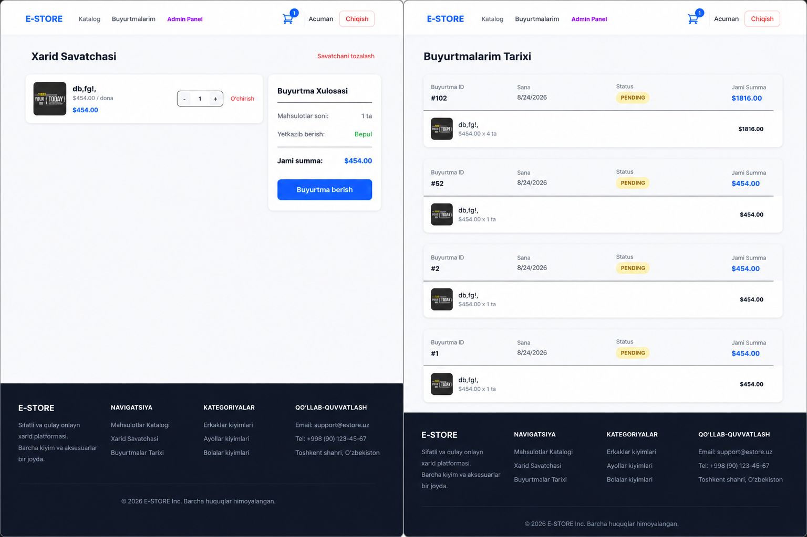

# 🛒 E-Commerce Backend API

A scalable and production-ready E-Commerce Backend built with Node.js, Express.js, MongoDB, and JWT Authentication. This project provides all essential e-commerce functionalities including authentication, product management, cart management, order processing, reviews, wishlist, coupons, and payment integration.



## 🚀 Features

### Authentication & Authorization

* User Registration & Login
* JWT Authentication
* Role-Based Access Control (Admin/User)
* Protected Routes
* Password Hashing with bcrypt

### Product Management

* Create Products
* Update Products
* Delete Products
* Product Search & Filtering
* Product Images Upload
* Product Categories & Subcategories

### Shopping Experience

* Shopping Cart
* Wishlist
* Product Reviews & Ratings
* Coupons & Discounts

### Order Management

* Create Orders
* Order History
* Order Status Tracking
* Cash Orders
* Online Payment Checkout

### Administration

* Manage Products
* Manage Categories
* Manage Brands
* Manage Users
* Manage Orders

---

## 🛠️ Tech Stack

### Backend

* Node.js
* Express.js
* MongoDB
* Mongoose

### Authentication

* JWT
* bcrypt

### File Upload

* Multer

### Payments

* Stripe

### Validation & Security

* Express Validator
* Helmet
* CORS

---

## 📂 Project Structure

```text
src
├── controllers
├── services
├── models
├── routes
├── middlewares
├── validators
├── utils
├── config
└── uploads
```

---

## ⚙️ Installation

### Clone Repository

```bash
git clone https://github.com/IncridableAcuman/e-commerce-backend.git
cd e-commerce-backend
```

### Install Dependencies

```bash
npm install
```

### Environment Variables

Create a `.env` file:

```env
PORT=5000

MONGO_URI=mongodb://localhost:27017/ecommerce

JWT_SECRET=your_jwt_secret

STRIPE_SECRET_KEY=your_stripe_secret

BASE_URL=http://localhost:5000
```

### Run Application

Development Mode

```bash
npm run dev
```

Production Mode

```bash
npm start
```

---

## 🔐 Authentication API

### Register

```http
POST /api/auth/signup
```

Request:

```json
{
  "name": "John Doe",
  "email": "john@example.com",
  "password": "password123"
}
```

### Login

```http
POST /api/auth/signin
```

Response:

```json
{
  "token": "jwt_token"
}
```

---

## 📦 Main API Endpoints

### Authentication

| Method | Endpoint |
| ------ | -------- |
| POST   | /signup  |
| POST   | /signin  |

### Products

| Method | Endpoint     |
| ------ | ------------ |
| GET    | /product     |
| GET    | /product/:id |
| POST   | /product     |
| PUT    | /product/:id |
| DELETE | /product/:id |

### Categories

| Method | Endpoint      |
| ------ | ------------- |
| GET    | /category     |
| POST   | /category     |
| PUT    | /category/:id |
| DELETE | /category/:id |

### Cart

| Method | Endpoint  |
| ------ | --------- |
| POST   | /cart     |
| GET    | /cart     |
| PUT    | /cart/:id |
| DELETE | /cart/:id |

### Orders

| Method | Endpoint   |
| ------ | ---------- |
| POST   | /order     |
| GET    | /order     |
| GET    | /order/all |

### Wishlist

| Method | Endpoint  |
| ------ | --------- |
| PATCH  | /wishlist |
| DELETE | /wishlist |
| GET    | /wishlist |

### Reviews

| Method | Endpoint    |
| ------ | ----------- |
| POST   | /review     |
| GET    | /review     |
| PUT    | /review/:id |
| DELETE | /review/:id |

---

## 💳 Stripe Payment Integration

This project supports Stripe payment gateway integration for secure online payments.

Checkout Flow:

1. Add Products to Cart
2. Apply Coupon (Optional)
3. Create Checkout Session
4. Complete Payment
5. Generate Order

---

## 🔒 Security Features

* JWT Authentication
* Password Hashing (bcrypt)
* Protected Routes Middleware
* Role-Based Authorization
* Request Validation
* MongoDB Injection Protection
* CORS Security

---

## 🧪 Testing

Run tests:

```bash
npm test
```

---

## 🐳 Docker Support

Build Image

```bash
docker build -t ecommerce-backend .
```

Run Container

```bash
docker run -p 5000:5000 ecommerce-backend
```

---

## 📈 Future Improvements

* Redis Caching
* Email Verification
* Password Reset
* Refresh Tokens
* GraphQL API
* Elasticsearch Product Search
* Microservice Architecture
* Kubernetes Deployment

---

## 🤝 Contributing

Contributions are welcome!

1. Fork Repository
2. Create Feature Branch
3. Commit Changes
4. Push Changes
5. Open Pull Request

---

## 📄 License

This project is licensed under the MIT License.

---

## 👨‍💻 Author

**Izzat Abdusharipov**

Backend Developer | Node.js | Express.js | MongoDB

GitHub: https://github.com/IncridableAcuman
